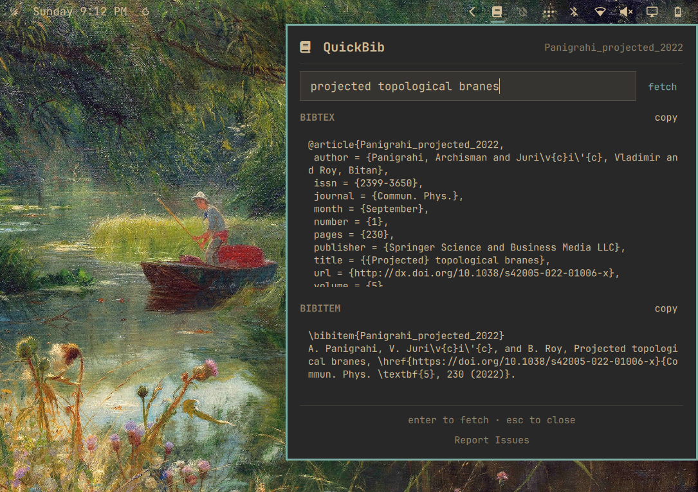

# QuickBib Omarchy Plugin

An [Omarchy](https://omarchy.org/) shell plugin for [QuickBib](https://archisman-panigrahi.github.io/QuickBib):
fetch a **BibTeX** entry and an APS-style **`\bibitem`** for a DOI, arXiv ID, or paper URL,
straight from the bar. Powered by the [`doi2bib3`](https://github.com/archisman-panigrahi/doi2bib3)
Python package.

<!-- Optional: drop a screenshot named preview.png in the repo root and
     uncomment the next line -- the marketplace picks it up automatically.

-->

Note: While this plugin uses arXiv and crossref APIs and does not use any AI/ML algorithms
in the runtime, it was initially vibe coded with OpenCode.

## Install

```bash
omarchy plugin add https://github.com/archisman-panigrahi/QuickBib-omarchy-plugin.git --enable
```

## Remove

```bash
omarchy plugin remove archisman.quickbib
```

## Usage

- Click the book glyph in the bar's right section, or run:
  `omarchy-shell shell toggle archisman.quickbib`
- Paste a DOI (`10.1103/PhysRevA.100.042101`), an arXiv ID (`2401.12345`),
  or a publisher/article URL.
- Press Enter or click *fetch*.
- Copy the whole entry with its section's **copy** button, or select any part
  of the text and press **Ctrl+C**.
- "Report Issues" at the bottom of the panel opens this repository's issue tracker.

## External dependencies

| Dependency | Purpose | Notes |
|---|---|---|
| Python package `doi2bib3` | Fetches BibTeX from DOI / arXiv / URL | On Arch/Omarchy: AUR package `python-doi2bib3`. The plugin detects when it is missing and offers a one-click guided install. |
| `wl-copy` | Copy buttons | Ships with Omarchy's clipboard tooling. |

**About the installer button:** Omarchy never executes plugin code at install
time, so nothing is installed silently. When the dependency is missing, the
panel explains exactly what will happen and only runs Omarchy's own packaged
helper (`omarchy-pkg-aur-add python-doi2bib3`) in a floating terminal after you
click **Install** — you will see yay's output and can enter your sudo password
there. On non-Arch systems, install doi2bib3 into your user environment by hand
(e.g. a venv or pipx-style setup) instead.

## Layout

```
scripts/quickbib_fetch.py   thin bridge: identifier -> one JSON result
Model.js                    pure: constants + helper-output parsing
Service.qml                 non-visual: Process objects, clipboard, dep probe
Panel.qml                   render only: input field, results, copy buttons
```

One network pass per lookup: the BibTeX is fetched once and the `\bibitem`
is derived locally via `format_bibtex_to_aps_bibitem`.

**Why a Python helper script?** QML cannot import Python packages, and every
bit of the actual work (DOI/arXiv/publisher resolution, BibTeX retrieval,
`\bibitem` formatting) lives in doi2bib3. The script is deliberately thin
glue — argparse, error handling, JSON output, nothing else — so all citation
logic stays in doi2bib3 where it is maintained and tested. The alternative
(reimplementing doi2bib3 in JavaScript) would be true duplication.

## Settings

In the shell settings panel for the widget:

- **Network timeout (seconds)** — default 15.

## Tests

```bash
python3 -m unittest discover -s tests
```

The suite stubs `doi2bib3`, so it never touches the network.

## Local testing

**Automated checks** (from a checkout of this repo):

```bash
python3 -m unittest discover -s tests        # unit tests (network stubbed)
qmllint Panel.qml Service.qml                # QML parse check (exit 255 = syntax error)
omarchy plugin validate .                    # manifest schema validation
```

**Fetch helper against real identifiers:**

```bash
scripts/quickbib_fetch.py 10.1103/PhysRevA.100.042101   # DOI
scripts/quickbib_fetch.py 2401.12345                    # arXiv ID
scripts/quickbib_fetch.py https://arxiv.org/abs/1706.03762  # URL
scripts/quickbib_fetch.py 10.9999/not-a-real-doi        # error path (JSON, exit 1)
```

**Live UI testing.** If you installed with `omarchy plugin add`, your
`~/.config/omarchy/plugins/archisman.quickbib` is a clone of this repo and hot-
reloads on every save; structural changes (new elements/properties) need
`omarchy restart shell`. Then:

```bash
omarchy-shell archisman.quickbib toggle      # open/close the panel from CLI
```

In the panel: fetch a DOI/arXiv ID/URL, select part of the output with the
mouse, Ctrl+C to copy it, try both section **copy** buttons, click
**Report Issues**.

**Testing the missing-dependency flow without uninstalling anything.** The
plugin exposes debug IPC that fakes the probe result:

```bash
omarchy-shell archisman.quickbib.dev simulateMissingDep   # notice + Install button appear, glyph dims
omarchy-shell archisman.quickbib.dev simulateDepOk        # back to normal
```

While simulating "missing", clicking **Install** still runs the real
installer — safe because `omarchy-pkg-aur-add` is idempotent for an already-
installed package (`--needed`) — and the periodic recheck probes the *real*
state, so the panel self-heals to "ok" once the import succeeds. That makes
the entire install path testable end-to-end without ever removing the package.

## License

GPL-3.0-only — same as doi2bib3. See [LICENSE](LICENSE).

## Publishing to GitHub and the Omarchy plugin marketplace

The community directory for Omarchy shell plugins is
[omarchyplugins.com](https://omarchyplugins.com), run from
[HANCORE-linux/omarchy-plugin-marketplace](https://github.com/HANCORE-linux/omarchy-plugin-marketplace).
Listing is done by opening one formatted issue on that repository; automated
validation and a maintainer review take it from there.

**1. Commit and push the repository**

```bash
cd ~/Work/QuickBib-omarchy-plugin   # or wherever your clone lives
git add -A && git commit -m "Initial release: QuickBib Omarchy shell plugin"
gh auth login                       # if not already authenticated
gh repo create archisman-panigrahi/QuickBib-omarchy-plugin --public --source=. --push
```

**2. Pre-submission checks**

- The repo is **public**, with `manifest.json`, this README (install +
  removal instructions), and `LICENSE` at the repository root — all required.
- Optional: add a screenshot as `preview.png` in the repo root, then uncomment
  the image line at the top of this file. The marketplace generates optimized
  card images automatically.
- Search [omarchyplugins.com](https://omarchyplugins.com) to confirm the plugin
  ID `archisman.quickbib` is not already listed — marketplace IDs are
  permanent and unique across all repositories.

**3. Submit the listing issue**

```bash
cat > /tmp/omarchy-plugin-submission.md <<'EOF'
### Repository URL

https://github.com/archisman-panigrahi/QuickBib-omarchy-plugin

### Category

Productivity

### Tags

quickshell, bar

### Suggest a missing tag

bibtex

### Maintainer notes

Fetches BibTeX entries and APS-style \bibitem output for DOIs, arXiv IDs, and
paper URLs from inside an Omarchy shell bar widget. Depends on the AUR package
python-doi2bib3 (documented in README). The dependency is never installed
silently: when missing, the panel explains the exact helper command
(omarchy-pkg-aur-add python-doi2bib3) that its Install button will run in a
floating terminal, and nothing executes until clicked. All network work goes
through doi2bib3's public API; no other external calls.

### Submission checklist

- [x] The repository is public and contains installation and removal instructions.
- [x] I have documented the plugin license and any external dependencies.
- [x] I confirm that I own or have permission to submit this plugin and its preview assets.
- [x] The plugin does not overwrite user configuration without explicit consent.
- [x] I understand that approval is for listing and is not a security review.
EOF

${EDITOR:-vi} /tmp/omarchy-plugin-submission.md   # review before creating

gh issue create \
  --repo HANCORE-linux/omarchy-plugin-marketplace \
  --title "[Plugin]: QuickBib" \
  --body-file /tmp/omarchy-plugin-submission.md
```

The title must start with `[Plugin]:` and all six headings must stay in their
original order, or validation will not pick the submission up. After the issue
opens, watch it for the automated validation and security-baseline comments;
a maintainer applies final approval.

**4. After publishing — make your local install updatable**

Once the repo is on GitHub, convert the installed copy into a clone so future
updates flow through `omarchy plugin update archisman.quickbib`:

```bash
omarchy plugin remove archisman.quickbib
omarchy plugin add https://github.com/archisman-panigrahi/QuickBib-omarchy-plugin.git --enable
```

To ship an update later: commit + push to `main`, then run
`omarchy plugin update archisman.quickbib`. If the marketplace listing should
reflect the newer commit, use its "Verify and publish a newer upstream commit"
issue form with the new full HEAD SHA.
